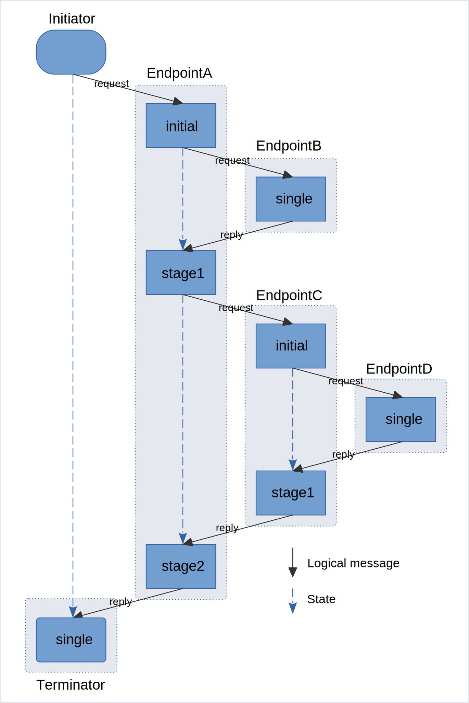

# Mats<sup>3</sup> - Message-based Asynchronous Transactional Staged Stateless Services

*Introducing "MOARPC" - Message-Oriented Asynchronous Remote Procedure Calls!*

*Mats* is a Java library that facilitates the development of asynchronous, stateless (or stateful, depending on your
point of view), multi-stage, message-based services. Mats Endpoints immediately provide all the benefits you get from a
fully asynchronous messaging-based architecture, while being *almost* as simple to code as blocking, synchronous
JSON-over-HTTP "REST" endpoints.

*Currently, to play around with the library, the simplest option is to clone it and run `./gradlew clean check`. After
this pans out, fire up your IDE and head over to the unit/integration tests of
[API](mats-api-test/src/test/java/io/mats3/api_test), [Spring](mats-spring/src/test/java/io/mats3/spring),
[MatsFuturizer](mats-util/src/test/java/io/mats3/util/futurizer), and tests of the testing tools for
[JUnit](mats-test-junit/src/test/java/io/mats3/test/junit) /
[Jupiter](mats-test-jupiter/src/test/java/io/mats3/test/jupiter) /
[Spring](mats-spring-test/src/test/java/io/mats3/spring/test). There's also a very rudimentary "dev area" for the
Metrics Interceptor
[MatsMetrics_TestJettyServer](mats-intercept-micrometer/src/test/java/io/mats3/test/metrics/MatsMetrics_TestJettyServer.java),
and same for Local Introspector
[LocalHtmlInspect_TestJettyServer](mats-localinspect/src/test/java/io/mats3/localinspect/LocalHtmlInspect_TestJettyServer.java), 
both of which you may start from your IDE.*

To use Mats in a project, fetch [`mats-impl-jms`](https://mvnrepository.com/artifact/io.mats3/mats-impl-jms)
from [Maven Central](https://mvnrepository.com/artifact/io.mats3).

License: [Polyform Perimeter 1.0.0 with examples](LICENSE.md)

If you find Mats interesting, you might want to check out the "companion
project" [MatsSocket](https://github.com/centiservice/matssocket).

# Documentation

Go to the [docs](docs/) folder.

# What is Mats?

There's a document going into details [here](docs/WhatIsMats.md), and for the rationale behind
Mats [here](docs/RationaleForMats.md).

Description of what Mats is, in multiple short forms, from several different angles:

### A picture is worth...



The above illustration can be viewed as REST-endpoints invoking other REST-endpoints, the dotted lines representing
blocking waits on the other endpoints responses. Or it can be viewed as Mats Endpoints (light blue boxes) invoking other
Mats Endpoints, the dotted lines representing the state which are "magically" present between the Stages (dark blue
boxes) of the Endpoints, but which are passed along with the message envelopes. The full execution from Initiator to
Terminator is called a _Mats Flow_.

Unit test code for this setup can be
found [here](mats-api-test/src/test/java/io/mats3/api_test/stdexampleflow/Test_StandardExampleMatsFlow.java).

### Better Inter Service Communication with Messaging

In a system made up of multiple services, e.g. a microservice architecture, asynchronous messaging gives many benefits
compared to the more classical synchronous JSON-over-HTTP-based communications.

Mats lets you use messaging without having to massively change your mental model of how to create inter service
endpoints: You might code your Mats Endpoint to receive a request, invoke a few collaborating services, calculate the
result based on values both from the request and the responses from the services you invoked, and then return the
result.

### Multi-stage, message-based Endpoints

A Mats Endpoint may consist of multiple _Stages_, where each Stage is an independent consumer and producer of
messages, each stage consuming from a stage-specific queue on a message broker. The message queue name is simply a
direct mapping from the StageId, prefixed with (default) "mats.".

### Invokable message-based Endpoints

A Mats Endpoint's Stage may invoke another Mats Endpoint by issuing a Request-call (`processContext.request(..)`)
targeting the EndpointId of the Endpoint you want to invoke. The Reply from this Request will be received by next Stage.

### Messaging with a Call Stack!

Invoked Mats Endpoints does not need to know who called them, they just return their result which is packaged up in a
message called a Reply. The Stage that performs the invocation doesn't have to specify which StageId the Reply should go
to, as Mats already knows this: It is the next stage of the Endpoint. The invoked Endpoint doesn't have to look up
the Reply queue address, as it is automatically fetched from the message's envelope's call stack.

When a Stage N performs such a Request to another Mats Endpoint, a State Object is left behind on the call stack,
which carries the information that is needed from Stage N to Stage N+1. When Stage N+1 receives the Reply from the
invoked Endpoint, the state object which was present on Stage N will "magically" be provided.

There is no theoretical limit to the nesting level of the call stack - but there is a "stack overflow" protection
mechanism which kicks in if an Endpoint for example invokes itself.

### Stateless

The entire state of a _Mats Flow_ is kept in the messages' envelope. No state is kept on the service instances
(nodes / pods / hosts / servers - whatever unit carries the service instances' JVMs).

This means that a service instance may be shut down without any consequences, and without the need of taking it out of
any cluster or load balancer - it simply disconnects from the message broker. If there are multiple instances, the other
instances will just continue consuming from those queues as if nothing has happened (they will get some more load than
when they shared it with the now-offline instance). If there are no instances of this service left, inbound messages
targeting this service's Endpoints' Stages will just be queued up on the broker's queues - and when a service instance
comes back online, its Mats Endpoints will start consuming again, and the Mats Flows will continue as if nothing
happened. This makes maintenance, high availability, and deployment of new versions of the services effortless.

### Stateful

The multiple Stages of a Mats Endpoint are connected with a State Object, which are meant to emulate the local variables
you'd have in the handling method of an ordinary HTTP-endpoint which performs synchronous HTTP calls to other services.

### Asynchronous

When a Stage _N_ of some Endpoint performs a request to another Endpoint, no thread will explicitly be waiting for the
Reply. The thread that executed Stage N for this Flow will go back to pick up new messages for Stage N. When the
requested Endpoint eventually replies, the Reply will be put on the incoming queue for Stage _N+1_, where another
thread, possibly on another node, will pick it up and continue the execution for this Flow.

### Distributed

A Mats Flow's execution will be spread out in pieces - over the Stages of the Endpoints involved in the Flow, and over
the instances of the services that holds those Endpoints. The Mats Flow weaves a single thread through the
_Mats Fabric_, jumping from StageProcessor to StageProcessor through the different instances of the services. However,
this is just an emergent property of the system: When you code an Endpoint, you code and reason locally within that
Endpoint.

Each Stage's concurrency, i.e. the number of StageProcessors running, can be tuned independently to handle the total
load of all the Mats Flows. If there is a choke point, you'll find it using metrics: There will typically be a build-up
of messages on that Stage's queue (which also makes the head-of-queue message old). Intermittent small build-ups are
totally fine if the overall total latency of the involved Mats Flows doesn't become a problem - but otherwise you may
increase the concurrency for this particular Stage, or even increase the number of instances of the service holding the
problematic Endpoint. Or, it might be external resources at this stage making the problem, e.g. the database which is
employed: The query might be slow, or the database isn't beefy enough - this you will understand by looking at the stage
metrics, the StageProcessing being slow.

_Interactive_ Mats Flows, defined as "a human is waiting for the result", are given a "cut the line"-flag, and it
carries this through all the stages it passes through. This means that even if a massive batch of Mats Flows is
currently being processed with queues forming on several high-demand Endpoints, a user logging in to your system's user
portal, or looking up a customer on the backoffice application, will still get "immediate" response, pretty much as if
there was no load.

### Centralized error handling

If a Mats Flow, while weaving its line through the Mats Fabric, encounters an error, the message broker initiates
automatic retrying. But if this doesn't pan out either, the current message will "pop out" of the Mats Fabric, ending up
on the Dead Letter Queue. (The broker should preferably be set up to have individual DLQs per queue). This is monitored
on the message broker.

This makes the total system exceptionally distributed, but the _error handling_ is centralized.

There is a separate project providing a Mats-specific view of the queues and DLQs on the message broker:
[MatsBrokerMonitor](https://github.com/centiservice/matsbrokermonitor).

### Familiar feel

The hope is that coding a message-based Mats Endpoint _feels like_ coding an ordinary HTTP-based endpoint where you may
synchronously invoke other endpoints as part of the processing. You code "linearly" and reason locally - but you gain
all features of a fully Asynchronous Message Oriented Architecture.

### Production Ready

This code has for several years been running in production as the sole inter service communication layer in a quite
large financial system consisting of >50 services and applications and several hundred Mats Endpoints. This system has
multiple customer frontends, both web and apps, and several backend UIs for backoffice functions. Several million
messages are produced and consumed each day. The Message Broker in use in this production setup is Apache ActiveMQ, but
all unit and integration tests also run on Apache Artemis (formerly JBoss HornetQ, and what RedHat AMQ is built on).

For more, read [this](docs/WhatIsMats.md), then [this](docs/RationaleForMats.md).

## What Mats is not

Mats is not meant for e.g. stream processing of large amounts of small events. Mats is geared more towards "weighty"
processes and messages, and trades some performance for developer friendliness, transactionality and debugging features.
Solutions like Kafka might be what you want if you need to receive tens-of-thousands of events per second from your
massive fleet of IoT devices. Use Mats for the subsequent, more coarse-grained handling of the results of such
ingestion. _(That said, the throughput of a large Mats fabric with lots of Endpoints scales very well, and is only
limited by the throughput of your message broker setup as well as external resources as your services' databases)_

Also, Mats is not meant for events which require handling in a specific order, e.g. arrival order. The intention with
Mats is that you run multiple instances/replicas of each service. And on each instance, there are multiple
StageProcessors for each Stage. A Mats Flow typically consist of processing on multiple Endpoints with multiple Stages,
and there is no way to guarantee that two flows which are started in some close order, will run through those stages,
and finish in the same order they were started.

# Examples

Some examples taken from the [unit tests](mats-api-test/src/test/java/io/mats3/api_test). Notice the use of the JUnit
Rule `Rule_Mats`, which sets up an ActiveMQ in-memory server and creates a JMS-backed MatsFactory based on that.

In these examples, all the endpoints and stages are set up in one test class, and when invoked by the JUnit runner,
obviously runs on the same machine - but in actual usage, you would typically have each endpoint run in a different
process on different nodes. The DTO-classes, which acts as the interface between the different endpoints' requests and
replies, would in real usage be copied between the projects (in this testing-scenario, one DTO class is used as all
interfaces).

It is important to appreciate that each of the stages - also each stage in multi-stage endpoints - are handled by
separate threads. The state, request and reply objects are not shared references within a JVM, as they are marshalled
with the message that are passed between each stage of the endpoints. *All information for a process (a Mats Flow)
resides as contents of the Mats envelope which is being passed with the message.* In particular, if you have a process
running a three-stage Mats endpoint which is deployed on two nodes A and B, for a particular request, the first stage
might execute on node A, while the next stage on node B, and the last stage on node A again.

This means that what *looks like* a blocking, synchronous request/reply "method call" is actually fully asynchronous,
where a reply from an invoked service will be handled in the next stage by a different thread, quite possibly on a
different node if you have deployed the service in multiple instances.

## Simple send-receive

The following class exercises the simplest functionality: Sets up a Terminator endpoint, and then an initiator sends a
message to that endpoint. *(This example neither demonstrate the stack (request/reply), nor state keeping - it is just
the simplest possible message passing, sending some information directly from an initiator to a terminator endpoint)*

ASCII-artsy, it looks like this:
<pre>
[Initiator]   {sends to}
[Terminator]
</pre>

```java
public class Test_SimplestSendReceive {
    private static final Logger log = MatsTestHelp.getClassLogger();

    @ClassRule
    public static final Rule_Mats MATS = Rule_Mats.create();

    private static final String TERMINATOR = MatsTestHelp.terminator();

    @BeforeClass
    public static void setupTerminator() {
        // A "Terminator" is a service which does not reply, i.e. it "consumes" any incoming messages.
        // However, in this test, it countdowns the test-latch, so that the main test thread can assert.
        MATS.getMatsFactory().terminator(TERMINATOR, StateTO.class, DataTO.class,
                (context, sto, dto) -> {
                    log.debug("TERMINATOR MatsTrace:\n" + context.toString());
                    MATS.getMatsTestLatch().resolve(sto, dto);
                });
    }

    @Test
    public void doTest() {
        // Send message directly to the "Terminator" endpoint.
        DataTO dto = new DataTO(42, "TheAnswer");
        MATS.getMatsInitiator().initiateUnchecked(
                (msg) -> msg.traceId(MatsTestHelp.traceId())
                        .from(MatsTestHelp.from("test"))
                        .to(TERMINATOR)
                        .send(dto));

        // Wait synchronously for terminator to finish. NOTE: Such synchronicity is not a typical Mats flow!
        Result<StateTO, DataTO> result = MATS.getMatsTestLatch().waitForResult();
        Assert.assertEquals(dto, result.getData());
    }
}
```

## Simple request to single stage "leaf-service"

Exercises the simplest request functionality: A single-stage service is set up. A Terminator is set up. Then an
initiator does a request to the service, setting replyTo(Terminator). *(This example demonstrates one stack level
request/reply, and state keeping between initiator and terminator)*

ASCII-artsy, it looks like this, the line (pipe-char) representing the state that goes between Initiator and Terminator,
but which is kept "on the wire" along with the message flow, i.e. along with the request out to Service, and then reply
back to Terminator:
<pre>
[Initiator]    {request}
 |  [Service]  {reply}
[Terminator]
</pre>

```java
public class Test_SimplestServiceRequest {
    private static final Logger log = MatsTestHelp.getClassLogger();

    @ClassRule
    public static final Rule_Mats MATS = Rule_Mats.create();

    private static final String SERVICE = MatsTestHelp.service();
    private static final String TERMINATOR = MatsTestHelp.terminator();

    @BeforeClass
    public static void setupService() {
        // This service is very simple, where it simply returns with an alteration of what it gets input.
        MATS.getMatsFactory().single(SERVICE, DataTO.class, DataTO.class,
                (context, dto) -> {
                    return new DataTO(dto.number * 2, dto.string + ":FromService");
                });
    }

    @BeforeClass
    public static void setupTerminator() {
        // A "Terminator" is a service which does not reply, i.e. it "consumes" any incoming messages.
        // However, in this test, it resolves the test-latch, so that the main test thread can assert.
        MATS.getMatsFactory().terminator(TERMINATOR, StateTO.class, DataTO.class,
                (context, sto, dto) -> {
                    log.debug("TERMINATOR MatsTrace:\n" + context.toString());
                    MATS.getMatsTestLatch().resolve(sto, dto);
                });

    }

    @Test
    public void doTest() {
        // Send request to "Service", specifying reply to "Terminator".
        DataTO dto = new DataTO(42, "TheAnswer");
        StateTO sto = new StateTO(420, 420.024);
        MATS.getMatsInitiator().initiateUnchecked(
                (msg) -> msg.traceId(MatsTestHelp.traceId())
                        .from(MatsTestHelp.from("test"))
                        .to(SERVICE)
                        .replyTo(TERMINATOR, sto)
                        .request(dto));

        // Wait synchronously for terminator to finish. NOTE: Such synchronicity is not a typical Mats flow!
        Result<StateTO, DataTO> result = MATS.getMatsTestLatch().waitForResult();
        Assert.assertEquals(sto, result.getState());
        Assert.assertEquals(new DataTO(dto.number * 2, dto.string + ":FromService"), result.getData());
    }
}
```

## Multi-stage service and multi-level requests

Sets up a somewhat complex test scenario, testing request/reply message passing and state keeping between stages in
several multi-stage endpoints, at different levels in the stack. The code is a tad long, but it should be simple to read
through.

The main aspects of Mats are demonstrated here, notice in particular how the code of
<code>setupMainMultiStagedService()</code> *looks like* - if you squint a little - a linear "straight down" method with
two "blocking requests" out to other services, where the last stage ends with a return statement, sending off the Reply
to whoever invoked it.

Sets up these services:

* Leaf service: Single stage: Replies directly.
* Mid service: Two stages: Requests "Leaf" service, then replies.
* Main service: Three stages: First requests "Mid" service, then requests "Leaf" service, then replies.

A Terminator is also set up, and then the initiator sends a request to "Main", setting replyTo(Terminator).

ASCII-artsy, it looks like this, the lines representing the state that goes between the Initiator and Terminator and the
stages of the endpoints, but which is kept "on the wire" along with the message flow through the different requests and
replies:
<pre>
[Initiator]              {request}
 |  [Main S0 (init)]   {request}
 |   |  [Mid S0 (init)]  {request}
 |   |   |  [Leaf]       {reply}
 |   |  [Mid S1 (last)]  {reply}
 |  [Main S1]          {request}
 |   |  [Leaf]           {reply}
 |  [Main S2 (last)]   {reply}
[Terminator]
</pre>

**Again, it is important to realize that the three stages of the Main service (and the two of the Mid service) are
actually fully independent messaging endpoints (with their own JMS queue when run on a JMS backend), and if you've
deployed the service to multiple nodes, each stage in a particular invocation flow might run on a different node.**

The Mats API and implementation sets up a call stack that can be of arbitrary depth, along with stack frames whose state
flows along with the message passing, so that you can code *as if* you were coding a normal service method that invokes
remote services synchronously.

```java
public class Test_MultiLevelMultiStage {
    private static final Logger log = MatsTestHelp.getClassLogger();

    @ClassRule
    public static final Rule_Mats MATS = Rule_Mats.create();

    private static final String SERVICE_MAIN = MatsTestHelp.endpointId("MAIN");
    private static final String SERVICE_MID = MatsTestHelp.endpointId("MID");
    private static final String SERVICE_LEAF = MatsTestHelp.endpointId("LEAF");
    private static final String TERMINATOR = MatsTestHelp.terminator();

    @BeforeClass
    public static void setupLeafService() {
        // Create single-stage "Leaf" endpoint. Single stage, thus the processor is defined directly.
        MATS.getMatsFactory().single(SERVICE_LEAF, DataTO.class, DataTO.class,
                (context, dto) -> {
                    // Returns a Reply to the calling service with a alteration of incoming message
                    return new DataTO(dto.number * 2, dto.string + ":FromLeafService");
                });
    }

    @BeforeClass
    public static void setupMidMultiStagedService() {
        // Create two-stage "Mid" endpoint
        MatsEndpoint<DataTO, StateTO> ep = MATS.getMatsFactory()
                .staged(SERVICE_MID, DataTO.class, StateTO.class);

        // Initial stage, receives incoming message to this "Mid" service
        ep.stage(DataTO.class, (context, sto, dto) -> {
            // State object is "empty" at initial stage.
            Assert.assertEquals(0, sto.number1);
            Assert.assertEquals(0, sto.number2, 0);
            // Setting state some variables.
            sto.number1 = 10;
            sto.number2 = Math.PI;
            // Perform request to "Leaf" Service...
            context.request(SERVICE_LEAF, dto);
        });

        // Next, and last, stage, receives replies from the "Leaf" service, and returns a Reply
        ep.lastStage(DataTO.class, (context, sto, dto) -> {
            // .. "continuing" after the "Leaf" Service has replied.
            // Assert that state variables set in previous stage are still with us.
            Assert.assertEquals(new StateTO(10, Math.PI), sto);
            // Returning Reply to calling service.
            return new DataTO(dto.number * 3, dto.string + ":FromMidService");
        });
    }

    @BeforeClass
    public static void setupMainMultiStagedService() {
        // Create three-stage "Main" endpoint
        MatsEndpoint<DataTO, StateTO> ep = MATS.getMatsFactory()
                .staged(SERVICE_MAIN, DataTO.class, StateTO.class);

        // Initial stage, receives incoming message to this "Main" service
        ep.stage(DataTO.class, (context, sto, dto) -> {
            // State object is "empty" at initial stage.
            Assert.assertEquals(0, sto.number1);
            Assert.assertEquals(0, sto.number2, 0);
            // Setting state some variables.
            sto.number1 = Integer.MAX_VALUE;
            sto.number2 = Math.E;
            // Perform request to "Mid" Service...
            context.request(SERVICE_MID, dto);
        });
        ep.stage(DataTO.class, (context, sto, dto) -> {
            // .. "continuing" after the "Mid" Service has replied.
            // Assert that state variables set in previous stage are still with us.
            Assert.assertEquals(Integer.MAX_VALUE, sto.number1);
            Assert.assertEquals(Math.E, sto.number2, 0);
            // Changing the state variables.
            sto.number1 = Integer.MIN_VALUE;
            sto.number2 = Math.E * 2;
            // Perform request to "Leaf" Service...
            context.request(SERVICE_LEAF, dto);
        });
        ep.lastStage(DataTO.class, (context, sto, dto) -> {
            // .. "continuing" after the "Leaf" Service has replied.
            // Assert that state variables changed in previous stage are still with us.
            Assert.assertEquals(Integer.MIN_VALUE, sto.number1);
            Assert.assertEquals(Math.E * 2, sto.number2, 0);
            // Returning Reply to "caller"
            // (in this test it will be what the initiation specified as replyTo; "Terminator")
            return new DataTO(dto.number * 5, dto.string + ":FromMainService");
        });
    }

    @BeforeClass
    public static void setupTerminator() {
        // A "Terminator" is a service which does not reply, i.e. it "consumes" any incoming messages.
        // However, in this test, it resolves the test-latch, so that the main test thread can assert.
        MATS.getMatsFactory().terminator(TERMINATOR, StateTO.class, DataTO.class,
                (context, sto, dto) -> {
                    log.debug("TERMINATOR MatsTrace:\n" + context.toString());
                    MATS.getMatsTestLatch().resolve(sto, dto);
                });
    }

    @Test
    public void doTest() {
        // :: Arrange
        // State object for "Terminator".
        StateTO sto = new StateTO((int) Math.round(123 * Math.random()), 321 * Math.random());
        // Request object to "Main" Service.
        DataTO dto = new DataTO(42 + Math.random(), "TheRequest:" + Math.random());

        // :: Act
        // Perform the Request to "Main", setting the replyTo to "Terminator".
        MATS.getMatsInitiator().initiateUnchecked(
                (msg) -> msg.traceId(MatsTestHelp.traceId())
                        .from(MatsTestHelp.from("test"))
                        .to(SERVICE_MAIN)
                        .replyTo(TERMINATOR, sto)
                        .request(dto));

        // Wait synchronously for terminator to finish.
        // NOTE: Such synchronous wait is not a typical Mats flow!
        Result<StateTO, DataTO> result = MATS.getMatsTestLatch().waitForResult();

        // :: Assert
        // Assert that the State to the "Terminator" was what we wanted him to get
        Assert.assertEquals(sto, result.getState());
        // Assert that the Mats flow has gone through the stages, being modified as it went along
        Assert.assertEquals(new DataTO(dto.number * 2 * 3 * 2 * 5,
                        dto.string + ":FromLeafService" + ":FromMidService"
                                + ":FromLeafService" + ":FromMainService"),
                result.getData());
    }
}
```

## MatsFuturizer - the sync-async bridge

This class tests the most basic [`MatsFuturizer`](mats-util/src/main/java/io/mats3/util/MatsFuturizer.java) situation:
Sets up a single-stage endpoint, and then uses the MatsFuturizer to invoke this service, which returns
a `CompletableFuture` that will be completed when the Reply comes back from the requested endpoint.

How does this work in a multi-node setup, where the Reply should randomly come to this node, or any other node? Behind
the scenes, the MatsFuturizer sets up a `subscriptionTerminator` (a topic) that has the nodename as a part of the topic
name. Furthermore, the request uses the special `replyToSubscription` feature of an initiation, targeting this
node-specific topic. Thus, the Reply will only be picked up by this node.

Why a topic? Not because of a topic's "broadcast" functionality (it is only a single consumer on this specific node that
listens to this specific topic), but the topic's "if you're not there, the message is gone" effect: If the node is gone
in the time since the Mats flow was initiated, then so is obviously the Future's waiting thread, so no need to have any
messages stuck on the MQ.

There are multiple modes of operation of the MatsFuturizer, but all of them share the fact that completion of the future
cannot be guaranteed - simply because the node might be booted or die while the Mats flow is running. You can however
decide whether the Mats flow should run using persistent ("guaranteed") or non-persistent messaging.

**The futurizer should _only_ be employed on the "edges" of the Mats fabric**, where synchronous processes like
REST-endpoints needs to communicate with the asynchronous Mats fabric. _Never_ use the MatsFuturizer as a part of your
application-internal API - [read this](docs/developing/MatsComposition.md).

> As an alternative to the MatsFuturizer, you should check out [MatsSocket](https://github.com/centiservice/matssocket),
> which bridges the asynchronous nature of Mats all the way out to the end-user clients by using WebSockets.

```java
public class Test_MatsFuturizer_Basics {
    private static final Logger log = MatsTestHelp.getClassLogger();

    @ClassRule
    public static final Rule_Mats MATS = Rule_Mats.create();

    private static final String SERVICE = MatsTestHelp.service();

    @BeforeClass
    public static void setupService() {
        MATS.getMatsFactory().single(SERVICE, DataTO.class, DataTO.class,
                (context, msg) -> new DataTO(msg.number * 2, msg.string + ":FromService"));
    }

    @Test
    public void normalMessage() throws ExecutionException, InterruptedException, TimeoutException {
        MatsFuturizer futurizer = MATS.getMatsFuturizer();

        DataTO dto = new DataTO(42, "TheAnswer");
        CompletableFuture<Reply<DataTO>> future = futurizer.futurizeNonessential(
                "traceId", "OneSingleMessage", SERVICE, DataTO.class, dto);

        Reply<DataTO> result = future.get(1, TimeUnit.SECONDS);

        Assert.assertEquals(new DataTO(dto.number * 2, dto.string + ":FromService"), result.reply);
    }
}
```

# Try it out!

If you want to try this out in your project, I will support you!

-Endre, endre@stolsvik.com
